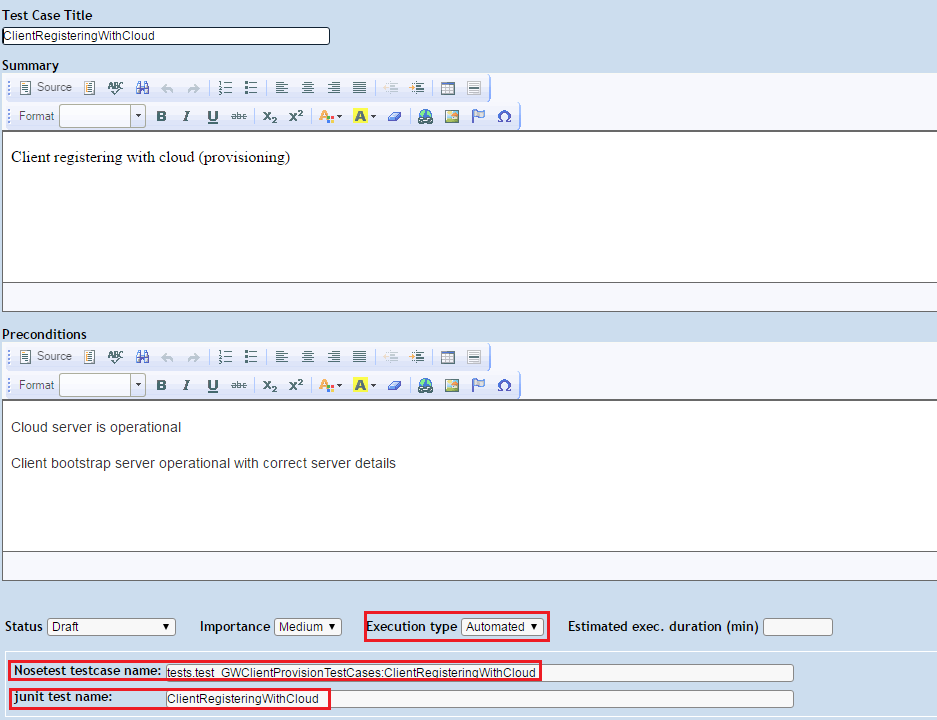

# Creator System Test Framework

## Set up TestLink

TODO -- notes on setting up TestLink server, jenkins TestLink plugin.

## Create a new test case within TestLink

### Log in to TestLink

In your browser navigate to the test link configuration page.

Enter your login details, if you don't already have an account click on the "New User?" link
and create a new account.

The dashboard screen should now be displayed.

### Creating a new test case

Select the "Test Specification" link, located at the bottom left of the page.

On the Test Specification page there is a tree that lists all of the test cases.

Select the position in the tree where you wish to create your new test case. for example,
to create a new smoke test you would select the "Smoke" folder icon.

At the top of the right hand window click the Actions icon

Click the Create icon next to the "Test Case Options" heading

Populate the "Test Case Title", "Summary" and "Preconditions" fields.

Select "Automated" for the Execution type

Enter the name that nose test uses to identify the testcase into the "Nosetest testcase name" box

Enter the name of the testcase into the "junit test name" box

Click the create button.

Add any steps required to your testcase. This defines the expected inputs and outputs.

Click the testlink logo to return back to the dashboard.

### Add your new Testcase to the Testplan

From the dash board, select the test plan from the drop down box and click ok.

In this case we will be using "System Test"

Click on the "Add / Remove Test Cases" link, located at the bottom right

At the bottom of the Add/Remove test cases page click on the Test Suite that contains your Test Case

Select your Test Case from the list on the right

Click the Add selected button.

Your new testcase will now be picked up on the next test run executed by jenkins.
